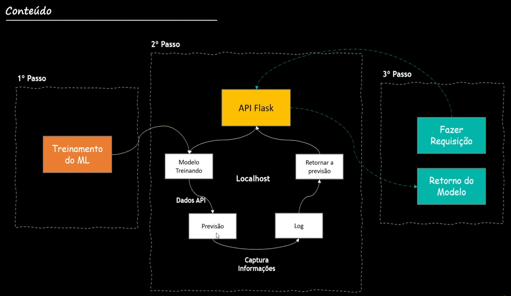

## Curso Machine Learning
Neste curso aprendi a criar um modelo de dados e disponibilizar em uma api com Flask.

### Arquivos
- model/house_data.csv > base de dados
- model/machine_learning.ipynb > arquivo com o código do modelo
- model/Modelo_Floresta_Aleatorio_v100.pkl > modelo salvo